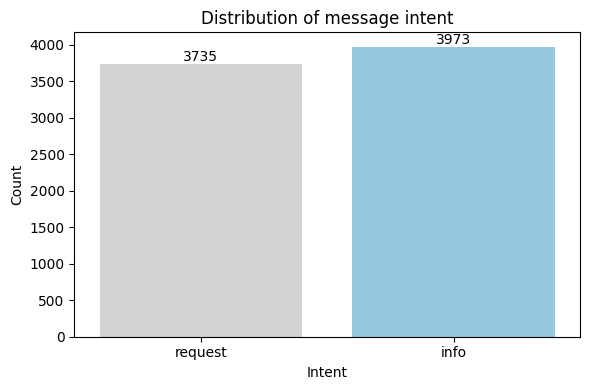
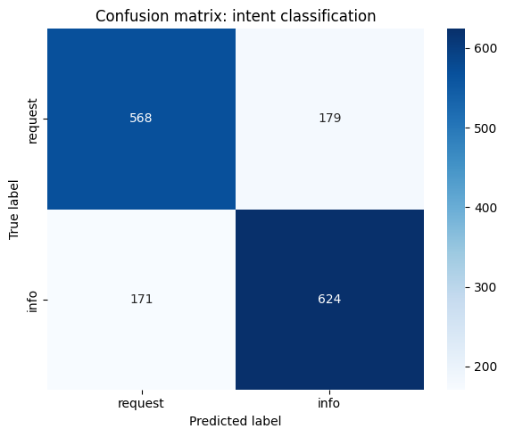

# Detecting Urgent Aid Requests in Haitian Disaster Messages

> *Automated triage for humanitarian response using interpretable NLP*

- Amee Hashley JEUDY
- Woodnalie Saviola JOSEPH 

In the chaotic aftermath of the 2010 Haiti earthquake, responders were overwhelmed by thousands of crisis messages many containing urgent pleas for food, water, or shelter. This project builds an **interpretable NLP classifier** that automatically identifies genuine aid requests from informational noise, using real-world SMS and social media data. The final model achieves **77% F1-score** and **0.86 ROC-AUC**, while providing transparent, actionable insights for field teams.

  
*Photo: Humanitarian aid distribution (Source: [HuffPost](https://www.huffpost.com/entry/remembering-the-2010-earthquake-that-devastated-haiti_n_65036d3ee4b084b3a93f65d3))*

## Business and Data understanding

### The problem
During disasters, humanitarian organizations receive massive volumes of unstructured messages via SMS, radio, and social media. Manual triage is slow and error-prone, and missing a single urgent request can cost lives. Automated filtering is very important to prioritize genuine pleas for aid.

### The data
This project uses the **Figure Eight Disaster Response Messages dataset**, a crowdsourced collection of 26 382 real crisis messages from the 2010 Haiti earthquake, Hurricane Sandy, and Nepal earthquake. Each message includes:
    - English-translated text (`message`)
    - Original Haitian Creole/French text (`original`)
    - Multi-label annotations across 36 humanitarian categories

We focus exclusively on **Haiti-related messages** and define a binary task:  
- **`request`**: Messages expressing urgent needs (51.5% of data)  
- **`info`**: All other messages (48.5%)  



## Modeling and Evaluation
### Approach
We compare three interpretable models:
1. **Logistic Regression** (primary baseline)
2. **Naive Bayes**
3. **Random Forest**

All use TF-IDF trigrams to capture critical phrases in short messages, with class balancing to handle near-equal class distribution.

### Key results
| Model                      | Accuracy | Macro F1 | ROC-AUC |
|----------------------------|----------|----------|---------|
| Logistic Regression (Tuned)| 0.773    | 0.773    | **0.862** |
| Random Forest              | **0.774**| **0.773**| 0.859   |
| Naive Bayes                | 0.764    | 0.764    | 0.852   |

**Why Logistic Regression?**  
Despite marginally lower accuracy than Random Forest, the **tuned Logistic Regression** is our recommended model because it is interpretable, transparent, lightweight, and ethical.



The model correctly identified 568 urgent requests and 624 informational messages. At the same time, it misclassified 179 true requests as informational and flagged 171 informational messages as urgent. These errors are nearly balanced, which indicates the model does not favor one class over the other. This balance is essential for fair and effective crisis response.

## Conclusion and Recommendations

### How to use this model
1. Prioritize high-confidence requests first: The model assigns higher scores to messages containing urgent keywords such as *need*, *help*, *water*, *food*, or *shelter*. Response teams should triage messages in descending order of prediction score. This ensures that the most likely genuine pleas for aid receive immediate attention, optimizing limited time and resources during emergencies.

2. Escalate low-confidence messages to human review: Messages with prediction scores near the decision threshold often contain ambiguous or mixed content. These should not be auto-classified. Instead, route them to human operators for final judgment. The model is a **triage assistant**, not a replacement for human oversight.

3. Promote clear messaging in affected communities: The model performs best when messages use direct, action-oriented language. Humanitarian organizations should:
   - Train community members to report needs using simple, concrete phrases  
   - Distribute SMS templates
   - Reinforce that clarity increases the chance of a rapid response  

### Limitations and Next steps
1. Limitations: The model relies on English-translated messages and may miss urgent requests expressed in Haitian Creole or French, potentially excluding vulnerable populations. It also uses word-frequency features, which limits its ability to capture context, tone, or nuanced phrasing.

2. Next steps:
   - Incorporate multilingual data (Creole, French) to improve inclusivity and recall.
   - Explore context-aware models (multilingual BERT) while preserving interpretability.
   - Develop a real-time triage dashboard that displays prediction scores and key urgency terms for rapid responder decision-making.

## Repository navigation

```
NLP_Phase_5_Project/
|-- Data
    |-- disaster_messages.csv
    |-- disaster_categories.csv
    |-- merged_disaster_data.csv
|-- images
    |-- conf_matrix.png
    |-- pict.webp
    |-- target_dist.png  
|-- notebooks
    |-- Project_5_FSM.ipynb
    |-- merged_notebook.ipynb
|-- Disater_Messages_NLP_Project_5.ipynb
|-- presentation.pdf
|-- Project_proposal.pdf
|-- requirements.txt
└-- README.md
```
- [View final notebook](Disater_Messages_NLP_Project_5.ipynb)
- [View presentation](presentation.pdf)

## Reproduction instructions

1. **Install dependencies**:
   ```bash
   pip install -r requirements.txt
   ```

2. **Download data**:  
   Place `disaster_messages.csv` and `disaster_categories.csv` in the project root.

3. **Run the notebook**:  
   Execute all cells in `nlp_haiti_disaster.ipynb` sequentially.


> **Note**: All results are reproducible with `random_state=42`. Expected output: `Accuracy ≈ 0.773 | Macro F1 ≈ 0.773 | ROC-AUC ≈ 0.86`


